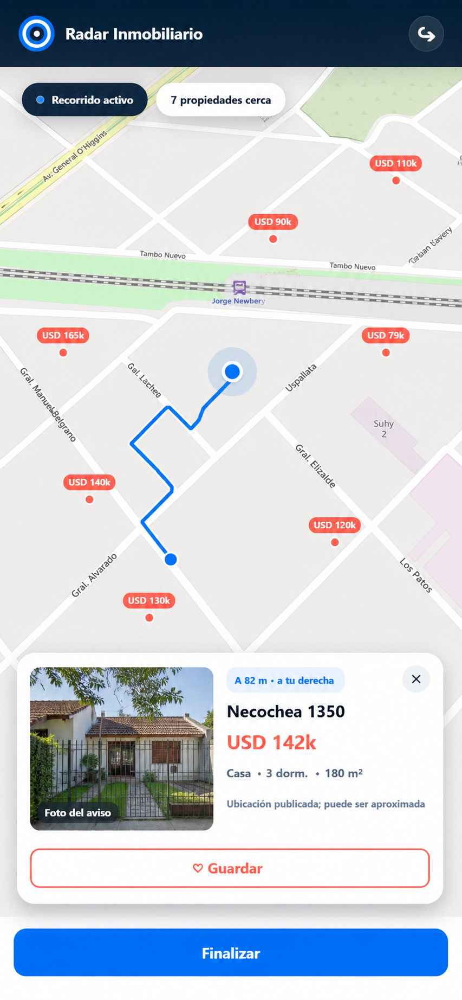
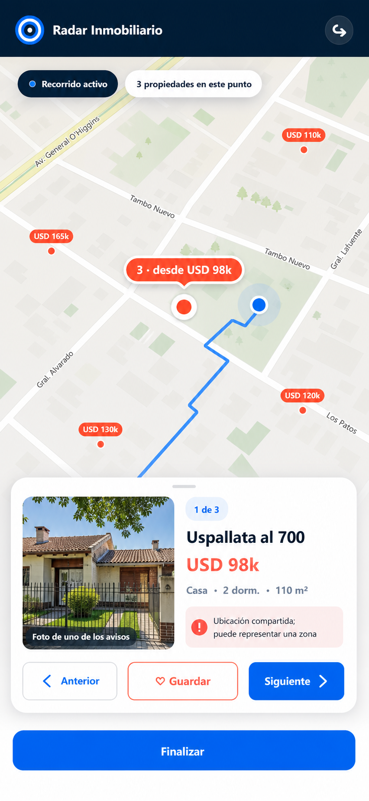
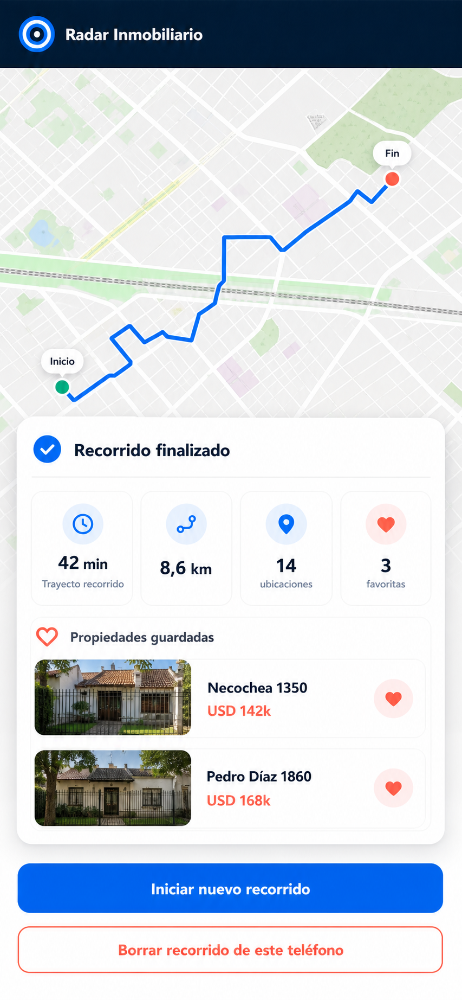

# Plan de desarrollo: Modo Recorrido — bloque 2

Fecha: 22 de agosto de 2026

Estado: implementado localmente; pendiente validación en teléfono y campo

Nombre del bloque: reconocimiento de propiedades y memoria del recorrido

## 1. Resultado esperado

Este bloque debe transformar la pantalla técnica actual en una herramienta útil
durante una recorrida. Al terminarlo, el usuario podrá:

1. reconocer una propiedad cercana por su foto y su dirección publicada;
2. recibir automáticamente una sola tarjeta de proximidad, sin tener que tocar
   cada marcador;
3. ver sobre el mapa la traza que realmente está recorriendo;
4. finalizar y obtener un resumen de toda la sesión, no solo de la última
   consulta al servidor;
5. recuperar o descartar un recorrido interrumpido por una recarga accidental.

La traza representa el camino realizado por el teléfono. No es una ruta
calculada y este bloque no incorpora origen, destino ni navegación giro a giro.

## 2. Alcance cerrado

### Incluido

- Ficha móvil bajo demanda con foto, dirección y confiabilidad de ubicación.
- Rediseño de la tarjeta para reconocimiento rápido.
- Apertura manual de la ficha al tocar un marcador.
- Selección automática de la propiedad o grupo relevante por proximidad.
- Dirección relativa —adelante, izquierda o derecha— únicamente cuando el
  rumbo sea suficientemente confiable.
- Registro local, filtrado y acotado de puntos GPS.
- Línea de recorrido en MapLibre.
- Acumulación de propiedades y grupos encontrados durante toda la sesión.
- Resumen final con duración, distancia aproximada, encontrados y favoritos.
- Recuperación controlada después de una recarga.
- Corrección de errores de ciclo de vida ya detectados en el primer bloque.
- Pruebas automáticas de backend y de las funciones puras de movimiento.
- MapLibre servido desde archivos propios y política de scripts restringida
  antes de guardar coordenadas en el navegador.

### Fuera de este bloque

- Selección de origen y destino.
- Navegación giro a giro, instrucciones de ruta o tiempo estimado de llegada.
- Integración con Google Maps o Android Auto.
- Voz y anuncios hablados.
- Historial permanente de recorridos en SQLite.
- Copia o sincronización de la base de datos con el celular.
- Clasificación automática de si una imagen es realmente una fachada.
- Reverse geocoding para inventar una dirección que no esté publicada.
- Proxy de imágenes externas.
- Manifest, service worker, instalación PWA y Cloudflare Tunnel.

Esos elementos quedan para bloques posteriores y no condicionan la utilidad de
esta entrega local.

## 2.1 Mockups visuales del bloque

Estos mockups forman parte de la especificación funcional. Fijan la jerarquía,
los datos que deben verse y el significado de la línea azul. La implementación
puede ajustar espaciado o tamaño según el teléfono, pero no debe cambiar esas
decisiones sin una nueva validación visual.

### Recorrido activo con identificación de la propiedad



Este estado valida:

- foto del aviso y dirección como elementos principales;
- distancia y dirección relativa solamente cuando el rumbo es confiable;
- una única tarjeta activa;
- filtros ocultos durante la marcha;
- línea azul dibujada únicamente detrás del teléfono, sin destino ni
  instrucciones de navegación.

### Varias publicaciones en una coordenada



Este estado valida:

- marcador agrupado con cantidad y precio mínimo;
- foto rotulada como perteneciente a uno de los avisos;
- navegación manual entre los miembros realmente recibidos;
- advertencia explícita de que la coordenada compartida puede representar una
  zona y no una fachada exacta.

### Resumen del recorrido completo



Este estado valida:

- mapa encuadrado sobre el trayecto realmente realizado;
- inicio y fin como extremos de una traza histórica, no como origen y destino
  de navegación;
- duración, distancia, ubicaciones encontradas y favoritas de toda la sesión;
- acceso a las propiedades guardadas;
- acciones separadas para comenzar otro recorrido o borrar la traza del
  teléfono.

## 3. Decisiones técnicas

### 3.0 Evidencia de la base actual

La auditoría sobre las 4.107 propiedades elegibles encontró:

- 4.086 con al menos una imagen en un aviso activo;
- 4.037 con dirección;
- 4.016 con imagen y dirección;
- 48.899 imágenes relacionadas, con hasta 100 imágenes en un aviso;
- 856 propiedades con más de un aviso activo;
- 1.833 URLs de imagen relativas que deben resolverse contra la URL del aviso.

Consecuencia: no se deben precargar todas las imágenes ni recorrer
`listing.images` dentro del loop espacial.

### 3.1 La consulta cercana seguirá siendo liviana

`POST /api/recorrido/cercanas/` seguirá enviando los campos compactos necesarios
para dibujar marcadores, agrupar coordenadas y elegir candidatos. No se
agregarán hasta 250 direcciones y URLs de imágenes a cada actualización.

Se añadirá una ficha bajo demanda:

```http
GET /api/recorrido/propiedad/123/ficha/
```

Solo se pedirá cuando el usuario toque un marcador o cuando el motor de
proximidad elija una tarjeta automática. La ficha se conservará en memoria
durante esa sesión para evitar solicitudes repetidas.

### 3.2 No habrá cambios de esquema

La información ya existe en `Property`, `Listing` y `ListingImage`. Este bloque
no necesita modelos nuevos ni migraciones. Tampoco modifica direcciones,
coordenadas, imágenes, publicaciones o correcciones manuales.

### 3.3 La traza pertenece al teléfono

Los puntos GPS no se enviarán a un endpoint de recorridos ni se guardarán en
SQLite. Las consultas cercanas continuarán enviando una posición puntual en el
cuerpo JSON, sin coordenadas en la URL ni en los logs de acceso normales.

Para sobrevivir a una recarga accidental se usará almacenamiento local acotado,
versionado y con vencimiento. Antes de habilitarlo se eliminará la dependencia
de JavaScript ejecutable desde `unpkg.com`: MapLibre se servirá desde
`/static/vendor/` y la página móvil limitará los scripts a archivos propios.

### 3.4 Las imágenes seguirán siendo externas

La tarjeta cargará directamente una única URL HTTPS de la publicación, con
`referrerpolicy="no-referrer"`. No se construirá todavía un proxy porque una
implementación incorrecta introduciría riesgo de SSRF y más carga sobre la PC y
el túnel.

La interfaz dirá “Foto del aviso”; no afirmará que la imagen sea necesariamente
la fachada.

## 4. Flujo del usuario

### 4.1 Antes de iniciar

- Configura tipo de propiedad y radio.
- Ve una explicación corta sobre ubicación y seguridad.
- Si existe una sesión interrumpida reciente, elige entre “Continuar” y
  “Descartar”.
- Toca “Iniciar recorrido”.

### 4.2 Durante el recorrido

- El mapa sigue la posición y dibuja detrás del vehículo la línea recorrida.
- Los filtros quedan en modo compacto para reducir controles mientras se
  conduce.
- Los precios permanecen visibles en el mapa.
- Al acercarse a una ubicación elegible aparece una sola tarjeta con foto,
  dirección, distancia, precio y confiabilidad.
- Tocar un marcador abre la misma tarjeta manualmente.
- Cerrar una tarjeta evita que vuelva a interrumpir durante esa sesión.
- Guardar como favorita sigue siendo la única mutación de una propiedad.

### 4.3 Al finalizar

- Se detienen `watchPosition`, requests pendientes y Wake Lock.
- El mapa deja de seguir al teléfono y encuadra la traza completa.
- Se muestran duración, distancia aproximada, ubicaciones/grupos encontrados,
  publicaciones únicas y favoritos confirmados.
- Se puede iniciar un nuevo recorrido o borrar inmediatamente la traza local.

## 5. Diseño de la tarjeta

La tarjeta debe priorizar reconocimiento y lectura de un vistazo:

```text
┌──────────────────────────────────────┐
│ A 82 m · a tu derecha             × │
│ ┌────────────┐  Necochea 1350       │
│ │ Foto del   │  USD 142k             │
│ │ aviso      │  Casa · 3 dorm · 180m²│
│ └────────────┘                       │
│ Ubicación publicada; puede aproximar │
│                         ♡ Guardar     │
└──────────────────────────────────────┘
```

Reglas visuales:

- La foto tendrá un área estable mínima aproximada de `112 × 84 px` en retrato.
- La dirección admitirá dos líneas y será más prominente que los datos
  secundarios.
- Distancia y dirección relativa estarán arriba; si el rumbo no es confiable se
  mostrará solamente la distancia.
- El texto y el placeholder se renderizarán sin esperar la descarga de la foto.
- Un error de imagen reemplazará la foto por un placeholder, sin cerrar la
  tarjeta ni producir una alerta técnica.
- Los controles táctiles tendrán al menos 44–48 px.
- Los filtros completos se usarán antes de iniciar; durante la marcha se
  mostrarán resumidos para liberar espacio de mapa.
- La tarjeta no exigirá ninguna interacción para continuar el recorrido.

### Grupos de coordenadas

- Una propiedad: tarjeta individual normal.
- Entre dos y cuatro publicaciones: encabezado “N propiedades en este punto” y
  navegación manual entre fichas; nunca se afirmará que todas sean la misma
  fachada.
- Cinco o más publicaciones en la misma coordenada: no se abrirá
  automáticamente una foto individual. El marcador y la tarjeta manual dirán
  que la coordenada puede representar una zona.

## 6. Contrato de la ficha móvil

Respuesta orientativa:

```json
{
  "id": 123,
  "price_short": "USD 142k",
  "type": "house",
  "type_label": "Casa",
  "bedrooms": 3,
  "bathrooms": 2,
  "area_m2": 180,
  "address_text": "Necochea 1350",
  "address_reliability": "published",
  "address_label": "Dirección publicada; puede ser aproximada",
  "location_reliability": "published",
  "location_label": "Ubicación publicada; puede ser aproximada",
  "image_url": "https://imagenes.example/casa-123.jpg",
  "is_favorite": false
}
```

Reglas:

- Requiere sesión autenticada.
- Responde `Cache-Control: private, no-store`.
- Devuelve `404` si la propiedad ya no es activa, visible, en venta, con precio
  válido, publicación activa o ubicación elegible.
- `address_text` usa primero la dirección canónica y luego la detectada; si falta,
  devuelve texto vacío y la interfaz muestra “Dirección no publicada”.
- `address_reliability` es `confirmed`, `published`, `detected` o `unavailable`.
- Una dirección solo será `confirmed` cuando exista una corrección manual del
  campo `address`. Un pin manual confirma la coordenada, pero no necesariamente
  el número de puerta.
- No se expondrá un booleano `address_exact`: la precisión `exact` del modelo
  describe el pin y la normalización histórica puede haber convertido
  expresiones como “al 1300” en una altura numerada.
- `image_url` se elige de forma determinista mediante subconsultas escalares:
  publicación activa más reciente que tenga imagen, menor `position` y luego
  menor ID.
- Una URL relativa se resuelve con `urljoin` contra la URL de su aviso; después
  se quitan credenciales y fragmentos y se acepta únicamente un resultado HTTPS
  absoluto y de longitud acotada.
- Si no existe imagen HTTPS, `image_url` queda vacío.
- La selección se hace con una cantidad constante de queries; nunca se recorren
  listings por cada marcador de la respuesta cercana.
- No devuelve descripción completa, notas, `raw_data`, snapshots,
  `manual_overrides`, evidencia interna, rutas de edición ni enlaces
  administrativos.

La lógica de elegibilidad se compartirá entre la consulta cercana y la ficha
para evitar que ambas rutas diverjan con el tiempo.

### 6.1 Consistencia de grupos

La respuesta cercana seguirá siendo compatible con la colección actual de
propiedades, pero la truncación pasará a ser consciente de los grupos:

- un grupo pequeño de dos a cuatro miembros no se corta por la mitad;
- cada miembro conserva su propio ID y puede solicitar su propia ficha;
- se agregan `group_returned_count` y `group_truncated`;
- un grupo grande puede devolver una representación acotada, pero la UI debe
  informar que existen miembros no recibidos;
- el representante se elige de forma determinista y nunca se lo presenta como
  la fachada de todos los miembros.

El contrato y las pruebas deben impedir que `group_count` afirme que se pueden
recorrer más fichas de las realmente incluidas.

## 7. Motor de movimiento y proximidad

### 7.1 Posiciones utilizables

Se incorporará `GeolocationPosition.timestamp`, `coords.speed` y `coords.heading`.

- Posición para centrar el mapa: se puede mostrar con precisión de hasta 150 m,
  siempre indicando el error.
- Posición para traza o tarjeta automática: precisión `≤ 60 m` y antigüedad
  `≤ 10 s`.
- Punto duplicado o movimiento menor que el umbral de ruido: no suma distancia.
- Salto equivalente a más de `160 km/h`: se rechaza de la traza urbana.
- Si falta rumbo GPS, se calcula con dos puntos separados suficientemente.
- “Izquierda/derecha/adelante” solo aparece con rumbo estable y velocidad
  aproximada de al menos `2 m/s`.
- Nunca se usará “lado de la calle”, porque no se conoce el carril ni el sentido
  real de circulación.

### 7.2 Traza

- Se acepta como máximo un punto cada 3 segundos.
- Normalmente se exige un avance de al menos 15 m.
- Se conserva un punto de continuidad cada 30 segundos aunque el avance sea
  menor.
- La sesión tendrá un máximo de 1.500 puntos o 4 horas.
- Al acercarse al límite se simplifica la línea preservando inicio, fin y forma
  general.
- La distancia se calcula solamente entre puntos aceptados y se presenta como
  aproximada.
- MapLibre tendrá una fuente GeoJSON `drive-trace` y una capa de línea situada
  debajo del usuario y los marcadores.

### 7.3 Selección automática

- Entrada al área de alerta: 120 m.
- Salida/histéresis: 170 m, para impedir parpadeos por jitter.
- Una apertura automática por grupo y recorrido.
- Mínimo 10 segundos entre aperturas automáticas.
- Los grupos sospechosos no generan una tarjeta individual automática.
- Con rumbo confiable se priorizan propiedades adelante o a los lados y se
  descartan las que ya quedaron claramente detrás.
- Sin rumbo confiable se elige la ubicación no anunciada más cercana.
- Solo puede haber una tarjeta activa; no se forma una cola.
- El detalle puede precargarse al entrar en 170 m, pero su imagen solo se carga
  al mostrar la tarjeta.

### 7.4 Red y ciclo de vida

- Se distinguirá “último intento” de “última consulta exitosa”.
- Un fallo no moverá el punto de referencia que bloquea la siguiente consulta.
- Los reintentos usarán pausas de 3, 6 y 12 segundos, sin crear un bucle estando
  quieto.
- Una respuesta vieja se descarta mediante `AbortController` y un identificador
  de generación.
- Wake Lock se volverá a solicitar si fue liberado al regresar al primer plano.
- Un segundo recorrido reiniciará todos los timestamps, puntos de consulta,
  abort controllers, encontrados, alertados, fichas y contadores.

## 8. Estado local de la sesión

Esquema orientativo:

```json
{
  "version": 1,
  "session_id": "uuid",
  "status": "tracking",
  "started_at": "2026-08-22T20:00:00Z",
  "ended_at": null,
  "filters": {"property_type": "house", "radius_m": 350},
  "points": [{"lat": -34.59, "lng": -58.64, "t": 0, "accuracy": 18}],
  "distance_m": 0,
  "encounters": {},
  "announced_group_ids": [],
  "dismissed_group_ids": [],
  "favorite_property_ids": []
}
```

Condiciones:

- Se persiste como máximo una vez cada 5 segundos y también en `pagehide`.
- Una sesión activa vence a las 6 horas.
- Un resumen final vence a las 24 horas.
- Al vencer, iniciar un recorrido nuevo o tocar “Borrar recorrido”, se eliminan
  coordenadas y fichas guardadas.
- Cerrar sesión elimina también la sesión local y su traza; no elimina favoritos
  persistidos correctamente en SQLite.
- Nunca se almacenan contraseña, cookie, notas, descripción, evidencia interna
  ni respuestas completas de la API.
- Al recargar con una sesión activa válida se ofrece continuar o descartar; no
  se reactiva el GPS sin una acción explícita.
- Si el almacenamiento está bloqueado o sin cuota, el recorrido continúa en
  memoria y se informa que no podrá recuperarse tras una recarga.

## 9. Resumen final

La pantalla final mostrará:

- duración;
- distancia GPS aproximada;
- cantidad de ubicaciones/grupos encontrados;
- cantidad de publicaciones únicas observadas durante toda la sesión;
- favoritos guardados exitosamente durante la sesión;
- mapa encuadrado sobre la traza, con inicio y fin;
- lista compacta de favoritos y fichas efectivamente mostradas, cuando sus datos
  estén disponibles localmente.

No se descargarán fotos de todas las propiedades únicamente para construir el
resumen. Los resultados dentro del radio son candidatos del mapa; una propiedad
se considera “encontrada” recién cuando entra en el umbral de 120 m con GPS
utilizable. El cliente recalcula esa distancia con cada posición aceptada y
conserva por grupo la primera detección y la distancia mínima.

“Finalizar” deja disponibles dos acciones claras:

- `Iniciar nuevo recorrido`: borra el estado anterior después de confirmarlo.
- `Borrar recorrido`: elimina inmediatamente coordenadas y resumen del teléfono.

## 10. Correcciones previas incluidas

Antes de añadir comportamiento se corregirán estos defectos de la base actual:

1. `lastQueryPosition` no se reinicia por completo al comenzar un segundo
   recorrido en el mismo lugar.
2. Se actualiza antes de confirmar que la consulta cercana tuvo éxito, lo que
   puede bloquear reintentos después de una caída de red.
3. El resumen actual cuenta solamente `latestProperties`, es decir, la última
   actualización y no todo el viaje.
4. Una posición sin comprobar su timestamp puede disparar proximidad con datos
   antiguos.
5. Wake Lock puede haber sido liberado aunque la variable JavaScript siga
   conteniendo un objeto.
6. Finalizar durante un request debe impedir que una respuesta tardía vuelva a
   dibujar datos o abra una tarjeta.

## 11. Archivos previstos

### Modificar

- `config/mobile_urls.py`
- `properties/drive_views.py`
- `properties/services/drive_mode.py`
- `properties/test_drive_mode.py`
- `templates/properties/drive.html`
- `static/css/drive-mode.css`
- `static/js/drive-mode.js`
- `docs/modo_recorrido_desarrollo.md`

### Crear

- módulo JavaScript de cálculos puros para GPS, rumbo, proximidad y resumen;
- tests `node:test` de ese módulo;
- archivos locales de MapLibre y su licencia en `static/vendor/maplibre/`;
- opcionalmente un módulo separado para serializar/restaurar la sesión.

No se prevén migraciones ni dependencias JavaScript de test adicionales.

## 12. Orden de implementación y puertas de salida

### Etapa A — Base privada y ciclo de vida

- Vendorizar MapLibre y retirar `unpkg.com` de la plantilla.
- Restringir scripts de la página móvil a recursos propios.
- Extraer funciones puras.
- Corregir reinicio, retry, request obsoleto y Wake Lock.

Puerta de salida:

- la página no ejecuta JavaScript remoto;
- comenzar dos recorridos consecutivos fuerza una consulta inicial en ambos;
- finalizar invalida cualquier callback pendiente;
- `node --check` y pruebas puras iniciales pasan.

### Etapa B — Ficha de propiedad

- Crear serializer/servicio de ficha y endpoint autenticado.
- Aplicar selección de dirección, confiabilidad e imagen.
- Añadir tests de elegibilidad, seguridad y queries.

Puerta de salida:

- una ficha individual devuelve foto/dirección cuando existen y fallbacks
  seguros cuando no;
- `/cercanas/` mantiene tamaño y queries constantes;
- la respuesta no contiene campos internos.

### Etapa C — Tarjeta reconocible

- Rediseñar HTML/CSS.
- Abrir ficha al tocar marcador.
- Implementar placeholder y fallo de imagen.
- Compactar controles durante el recorrido.
- Resolver grupos pequeños y sospechosos.

Puerta de salida:

- funciona en 360×640, 390×844 y paisaje;
- dirección y precio se leen sin esperar la foto;
- imagen rota no rompe el layout;
- no se presenta una ubicación aproximada como fachada confirmada.

### Etapa D — Traza y estado de sesión

- Filtrar y acumular puntos.
- Dibujar la línea.
- Calcular distancia.
- Persistir, restaurar, vencer y borrar el estado local.

Puerta de salida:

- estar detenido no infla materialmente la distancia;
- un salto imposible no deforma la traza;
- una recarga ofrece continuar o borrar;
- ninguna coordenada aparece en SQLite, URLs o Cache Storage.

### Etapa E — Proximidad automática

- Acumular encuentros y distancias mínimas.
- Implementar histéresis, rumbo, deduplicación y cooldown.
- Precargar ficha y abrir una sola tarjeta.

Puerta de salida:

- no hay alertas con GPS viejo o impreciso;
- una ubicación no se anuncia dos veces en el mismo recorrido;
- jitter alrededor de 120 m no abre/cierra repetidamente;
- los grupos sospechosos no se anuncian como una casa individual.

### Etapa F — Resumen y validación integral

- Construir resumen acumulado.
- Encuadrar traza e inicio/fin.
- Añadir acciones de nuevo recorrido y borrado.
- Ejecutar pruebas automáticas, QA móvil y benchmark real.

Puerta de salida:

- el resumen representa toda la sesión;
- todos los recursos de GPS, red y Wake Lock quedan liberados;
- un nuevo recorrido empieza sin datos anteriores;
- se cumplen los criterios de aceptación de la sección 15.

## 13. Estrategia de pruebas

### Backend Django

- Ficha anónima `401` y autenticada `200`.
- Propiedad inactiva, oculta, sin listing activo o imprecisa: `404`.
- Prioridad entre dirección canónica, detectada y ausente.
- Ubicación manual preservada y rotulada como confirmada.
- Listing activo/inactivo, varias imágenes y orden determinista.
- URL relativa se resuelve contra el aviso; URL HTTP, insegura o ausente
  produce placeholder, no URL servida.
- Grupo pequeño no se trunca; grupo grande declara cuántos miembros fueron
  devueltos y si quedó incompleto.
- `no-store` en ficha y rutas de datos.
- Ausencia de notas, raw data, snapshots, overrides y evidencias.
- Cantidad constante de queries (`≤ 3`) en cercana y ficha.
- Favorito continúa modificando únicamente `is_favorite`.

### JavaScript puro con `node:test`

- Haversine y bearing.
- Antigüedad y precisión de posiciones.
- Punto duplicado, jitter y salto imposible.
- Muestreo, límite y simplificación de traza.
- Distancia de una ruta conocida.
- Entrada/salida con histéresis.
- Selección con y sin rumbo.
- Deduplicación y cooldown.
- Acumulación de encuentros y distancia mínima.
- Serialización, versión, vencimiento y restauración.
- Reinicio completo entre sesiones.

### Navegador y dispositivo

- Foto válida, lenta, rota y ausente.
- Dirección larga, aproximada y ausente.
- Marcador individual, grupo pequeño y grupo sospechoso.
- Permiso denegado, GPS impreciso y posición vieja.
- Caída de red, recuperación y respuesta obsoleta.
- Ocultar/mostrar app y liberación de Wake Lock.
- Recarga accidental, continuar y descartar.
- Finalizar durante una consulta.
- Retrato y paisaje en Android Chrome.

### Prueba de campo

1. Ubicación simulada en escritorio.
2. Teléfono quieto durante al menos 10 minutos.
3. Caminata corta con ruta conocida.
4. Auto con acompañante operando la pantalla.

La primera prueba en vehículo no será manipulada por la persona que conduce.

## 14. Objetivos medibles

| Métrica | Objetivo |
|---|---:|
| API cercana local p95 | < 150 ms |
| API ficha local p95 | < 150 ms |
| API por túnel/datos móviles p95, cuando se pruebe | < 800 ms |
| Queries SQL de cercanas | ≤ 3, independiente del resultado |
| Queries SQL de ficha | ≤ 3 |
| Payload cercano p95 / máximo | < 100 KB / < 250 KB |
| Consultas cercanas en movimiento | ≤ 12 por minuto |
| Apertura desde posición aceptada, ficha ya cargada | < 500 ms |
| Apertura con solicitud de ficha | < 1,2 s en prueba remota |
| Resumen de 1.500 puntos | < 100 ms en teléfono de prueba |
| Estado local completo | < 1 MB |
| Datos móviles | objetivo < 30 MB/h; techo 50 MB/h |
| Consumo de batería en prueba | ≤ 15 puntos porcentuales/hora |

Los tiempos p95 se medirán con un benchmark repetible sobre la base real; no se
convertirán en asserts frágiles de CI. Las pruebas automáticas sí controlarán
queries, campos y tamaño de payload.

## 15. Criterios de aceptación del bloque

El bloque estará terminado cuando:

- tocar un marcador individual muestre foto y dirección cuando existan;
- la interfaz tenga fallbacks comprensibles si faltan o fallan;
- la foto esté rotulada como proveniente del aviso y la dirección indique su
  grado de confiabilidad;
- una propiedad cercana pueda abrirse automáticamente sin interacción;
- GPS impreciso, viejo o un grupo sospechoso no produzcan una afirmación falsa;
- el mapa dibuje la traza real aceptada y no una ruta hacia un destino;
- el resumen acumule todo el recorrido y no solo la última consulta;
- finalizar y comenzar de nuevo limpie correctamente todos los estados;
- una recarga permita recuperar o eliminar una sesión reciente;
- la traza no se envíe ni persista en la PC;
- no haya JavaScript remoto con acceso al almacenamiento de coordenadas;
- `/cercanas/` no sufra N+1 ni aumento material innecesario de payload;
- no se modifique ninguna corrección manual ni campo fuera de favoritos;
- las suites focalizadas, la suite Django completa y la validación visual pasen;
- la prueba caminando sea estable antes de probar con acompañante en un auto.

## 16. Riesgos y mitigaciones

| Riesgo | Mitigación |
|---|---|
| La primera foto es interior y no fachada | Rotular “Foto del aviso”; permitir reconocimiento por dirección; clasificador fuera de alcance |
| La inmobiliaria oculta o aproxima la dirección | Mostrar confiabilidad y nunca inventar número mediante reverse geocoding |
| URLs externas rotas o bloqueadas | Una sola imagen, HTTPS, `no-referrer`, `onerror` y placeholder |
| Un host de imágenes observa IP/hora de carga | Documentar el tercero; no enviar referrer; proxy endurecido solo si luego se justifica |
| N+1 o payload grande | Ficha bajo demanda con queries constantes |
| GPS infla distancia o deforma la línea | Precisión, movimiento mínimo, timestamp, velocidad máxima y simplificación |
| Jitter repite tarjetas | Histéresis 120/170 m, deduplicación y cooldown |
| Demasiadas tarjetas distraen | Una sola activa, sin cola, grupos sospechosos excluidos y controles compactos |
| Recarga conserva coordenadas demasiado tiempo | Vencimientos 6/24 h y botón de borrado inmediato |
| Código remoto lee la traza local | Vendorizar MapLibre y restringir `script-src` antes de persistir |
| El proveedor de mapas infiere el viewport por las teselas | Informarlo como tercero; proxy/cache propio queda como mejora posterior |
| Wake Lock se pierde | Estado visible y readquisición al volver al primer plano |
| Segundo recorrido hereda estado | Reset centralizado y pruebas de dos sesiones consecutivas |

## 17. Decisión para el bloque posterior

Una vez validada la utilidad de foto, dirección y traza, se evaluará por separado
la navegación. Las alternativas siguen siendo:

1. abrir la propiedad seleccionada en Google Maps;
2. incorporar un motor de rutas dentro de Radar para mantener marcadores y
   precios visibles.

No se mezclará esa decisión con este bloque porque implica otra arquitectura,
otros proveedores y una experiencia de conducción distinta.
